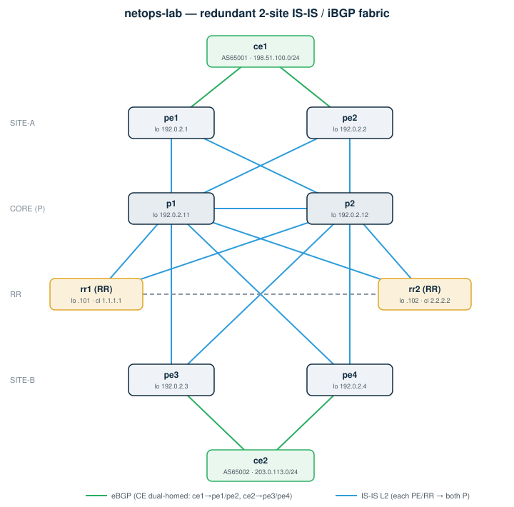

# netops-containerlab-ansible-vxlan

**Redundant SP fabric with EVPN-VXLAN L3VPN — no kernel modules, no MPLS, deployable anywhere Docker runs.**

A self-contained **network operations lab** you can run on a laptop, NAS or EVE-NG host.
It builds a realistic **service-provider fabric**: IS-IS wide-metric core, **EVPN-VXLAN** overlay putting both customer sites in one shared L3VNI, redundant route reflectors, and an **Ansible pipeline** that reboots the fabric with **proven zero packet loss** — drain → reboot → verify → restore, one device at a time.

> **vs. the MPLS variant:** VXLAN uses plain UDP/4789 over the IS-IS IP underlay. No `mpls_router` kernel module, no `net.mpls.platform_labels` sysctl — it just works wherever Docker runs.

---

## ⚡ Quick start (4 steps)

> Prereqs: **Docker**, **containerlab**, and **Ansible** installed (see [§1 Install the tools](#1-install-the-tools-one-time) if you do not have them). **No kernel modules required.**

```bash
# 1) get the lab
git clone https://github.com/AlekseiChek/netops-containerlab-ansible-vxlan
cd netops-containerlab-ansible-vxlan

# 2) build the whole topology (10 routers + wiring, ~1–2 min)
cd clab && sudo containerlab deploy -t stage1.clab.yml && cd ..

# 3) EVPN init — required once after deploy (see note below)
bash tools/init-evpn.sh

# 4) prove a zero-loss rolling reboot of the core
cd ansible && ansible-galaxy collection install -r requirements.yml && ansible-playbook playbooks/safe-reboot.yml
```

Watch it live — open a second terminal while step 4 runs:
```bash
docker exec clab-stage1-ce1 ping -I 198.51.100.1 203.0.113.1
```
The playbook drains → reboots → restores each router one at a time and **asserts 0% packet loss** at the end.
Tear it all down: `sudo containerlab destroy -t clab/stage1.clab.yml --cleanup`

> **Why step 3?** FRR's bgpd has a startup race with zebra for L3VNI registration. bgpd queries zebra for VNIs before zebra finishes processing the VRF-VNI binding, so bgpd misses VNI 100 and generates no EVPN Type-5 routes. The script toggles `advertise-all-vni` which forces bgpd to re-query zebra. This is a known FRR startup behaviour — VyOS does not expose the RD/RT knobs for EVPN in its config system, so the fix cannot be baked into `config.boot`.

---

## Network scheme



<sub>Editable source: [`docs/topology.drawio`](docs/topology.drawio) — open in [draw.io](https://app.diagrams.net).</sub>

- **Core (8 × VyOS):** `p1`/`p2` (P routers), `rr1`/`rr2` (route reflectors), `pe1`–`pe4` (provider edge / VTEP).
- **Customers (2 × FRR):** `ce1`, `ce2` — each **dual-homed** to two PEs.
- **Two sites:** site-A = `ce1`↔`pe1`/`pe2`, site-B = `ce2`↔`pe3`/`pe4`.
- **IGP:** IS-IS Level 2 (area `49.0001`), **wide metrics**; every PE and RR is dual-attached to both P routers.
- **Overlay:** EVPN-VXLAN — each PE is a VTEP (source = loopback). `ce1` and `ce2` share **VRF `CUST`** (L3VNI 100) over VXLAN.
- **Control plane:** iBGP AS `65000`, **two route reflectors** reflecting both `ipv4-unicast` and `l2vpn-evpn`.
- **Customer routes:** advertised as **EVPN Type-5** (IP prefix) routes by each PE.

| Node | Role | NOS | Site | Loopback / VTEP |
|------|------|-----|------|-----------------|
| pe1–pe2 | PE / VTEP | VyOS | site-A | 192.0.2.1 / .2 |
| pe3–pe4 | PE / VTEP | VyOS | site-B | 192.0.2.3 / .4 |
| p1 / p2 | P (core) | VyOS | core | 192.0.2.11 / .12 |
| rr1 / rr2 | Route Reflector | VyOS | core | 192.0.2.101 / .102 |
| ce1 | Customer (VRF CUST → pe1/pe2) | FRR | site-A | 198.51.100.1 |
| ce2 | Customer (VRF CUST → pe3/pe4) | FRR | site-B | 203.0.113.1 |

---

## SP feature set (and how to verify it)

| Feature | Where | Verify command |
|---------|-------|----------------|
| IS-IS **wide metric** | all core | `docker exec clab-stage1-p1 vtysh -c "show isis database detail"` |
| **EVPN-VXLAN** overlay | PEs | `docker exec clab-stage1-pe1 vtysh -c "show bgp l2vpn evpn summary"` |
| **EVPN Type-5** routes | PEs | `docker exec clab-stage1-pe1 vtysh -c "show bgp l2vpn evpn route type prefix"` |
| **VRF CUST** (L3VNI 100) | PEs | `docker exec clab-stage1-pe1 vtysh -c "show ip route vrf CUST"` |
| **VXLAN** tunnel | PEs | `docker exec clab-stage1-pe1 ip -d link show vxlan100` |
| **l2vpn-evpn RR** | rr1/rr2 | `docker exec clab-stage1-rr1 vtysh -c "show bgp l2vpn evpn summary"` |

**Proof the two customers share one VRF** — CE1 should learn CE2's prefix over the EVPN-VXLAN and ping end-to-end:
```bash
docker exec clab-stage1-ce1 vtysh -c "show ip route 203.0.113.0/24"   # learned via EVPN
docker exec clab-stage1-ce1 ping -c2 -I 198.51.100.1 203.0.113.1      # CE1 -> CE2 across VXLAN
```

> **Why VXLAN and not MPLS?** VyOS/FRR implement EVPN over VXLAN only (no MPLS data plane for EVPN).
> VXLAN is plain UDP — no kernel modules, no sysctl tuning, works on any standard host.
> For the MPLS L3VPN variant (SR-MPLS + TI-LFA) see [`netops-containerlab-ansible-mpls`](https://github.com/AlekseiChek/netops-containerlab-ansible-mpls).

---

## 1. Install the tools (one-time)

```bash
# Docker — must be installed and running
docker --version

# containerlab — builds the topology
bash -c "$(curl -sL https://get.containerlab.dev)"
clab version

# Ansible — automates changes
python3 -m pip install --upgrade ansible paramiko
ansible --version

# pull the router images (first time only)
docker pull ghcr.io/sysoleg/vyos-container:latest    # core (VyOS)
docker pull frrouting/frr:latest                     # customers (FRR)
```

---

## 2. Start the lab

```bash
cd clab
sudo containerlab deploy -t stage1.clab.yml
sudo containerlab inspect -t stage1.clab.yml
```

VyOS takes ~30–60 s to boot. If BGP/EVPN looks stuck right after deploy, reset once:
```bash
for n in rr1 rr2 p1 p2 pe1 pe2 pe3 pe4; do docker exec clab-stage1-$n vtysh -c "clear bgp *"; done
```

**Check end-to-end:**
```bash
docker exec clab-stage1-ce1 ping -c2 -I 198.51.100.1 203.0.113.1
```

**Stop / delete:**
```bash
sudo containerlab destroy -t stage1.clab.yml --cleanup
```

---

## 3. Connect to a node manually

**VyOS core nodes — via SSH** (user `vyos`, password `vyos`):
```bash
ssh vyos@clab-stage1-pe1
# useful commands:
show bgp l2vpn evpn summary        # EVPN peers + prefix count
show bgp l2vpn evpn route type prefix   # Type-5 EVPN routes
show ip route vrf CUST             # VRF routing table
show interfaces vxlan              # VTEP state
show isis neighbor                 # IS-IS adjacencies
```

**Any node — via docker exec:**
```bash
docker exec -it clab-stage1-pe1 vtysh
docker exec clab-stage1-rr1 vtysh -c "show bgp l2vpn evpn summary"
docker exec clab-stage1-ce1 vtysh -c "show ip route"
```

> Tip: `docker ps` lists all container names (`clab-stage1-<node>`).

---

## 4. The Ansible automation

```bash
cd ../ansible
ansible-galaxy collection install -r requirements.yml
```

| Playbook | What it does | Changes network? |
|----------|-------------|-----------------|
| `facts.yml` | Connectivity check — SSH + BGP summary on every core node | No |
| `site.yml` | Safe config change — drain → precheck → deploy → postcheck → undrain | Yes |
| `safe-reboot.yml` | **Zero-loss rolling reboot** — proven by non-stop CE1↔CE2 ping | Reboots only |
| `compliance-check.yml` | Audit — IS-IS wide / BGP / l2vpn-evpn / VXLAN / VRF CUST on every PE | No |

```bash
ansible-playbook playbooks/facts.yml                       # connectivity check first
ansible-playbook playbooks/safe-reboot.yml                 # whole core, one at a time
ansible-playbook playbooks/safe-reboot.yml -e target=site_b
ansible-playbook playbooks/compliance-check.yml            # audit
```

---

## Repo layout

```
netops-containerlab-ansible-vxlan/
├── clab/
│   ├── stage1.clab.yml             # topology: 10 nodes + 17 links
│   ├── daemons / vtysh.conf        # FRR helpers (CE nodes)
│   └── configs/<node>/
│       ├── <core>/config.boot      # VyOS set-style (pe*/p*/rr*)
│       └── <ce>/frr.conf           # FRR (ce1/ce2)
├── ansible/
│   ├── ansible.cfg
│   ├── requirements.yml
│   ├── inventory/hosts.yml
│   ├── roles/{drain,precheck,deploy,postcheck,compliance}/
│   └── playbooks/{facts,site,safe-reboot,compliance-check}.yml
└── docs/topology.{svg,drawio}
```

---

## Production mapping

| Lab | Production |
|-----|-----------|
| VyOS / FRR containers | Juniper MX / Nokia SR Linux / Arista |
| EVPN-VXLAN L3VPN | Standard DC/SP overlay, same RFC 8365 |
| `serial: 1` Ansible | canary → wave → fleet rollout |
| postcheck asserts | golden-signal health gate |

---

## License

MIT — see `LICENSE`.
