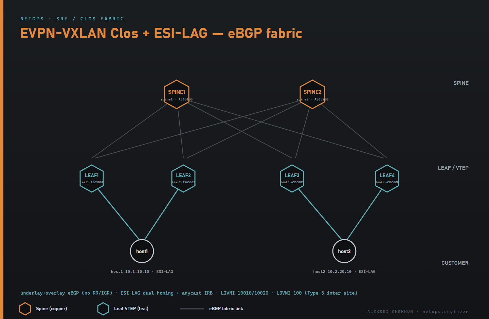

# netops-containerlab-ansible-vxlan

**3-stage EVPN-VXLAN data-center Clos with ESI-LAG multihoming — no kernel modules, no MPLS, runs anywhere Docker runs.**

A self-contained **network operations lab** you can run on a laptop, NAS or EVE-NG host.
It builds a realistic **DC fabric**: 2 spines + 4 leaves, **eBGP underlay + eBGP EVPN overlay** (no IGP, no route reflectors), **anycast IRB** gateways, **ESI-LAG** dual-homed servers, and **EVPN Type-5** routing between sites — plus an **Ansible pipeline** that reboots the fabric with **proven zero packet loss** (drain → reboot → verify → restore, one device at a time).

> **vs. the MPLS variant:** VXLAN is plain UDP/4789 over the eBGP IP underlay. No `mpls_router` kernel module, no `net.mpls.platform_labels` sysctl — it just works wherever Docker runs.

---

## ⚡ Quick start (4 steps)

> Prereqs: **Docker**, **containerlab**, and **Ansible** installed (see [§1 Install the tools](#1-install-the-tools-one-time) if you do not have them). **No kernel modules required.**

```bash
# 1) get the lab
git clone https://github.com/AlekseiChek/netops-containerlab-ansible-vxlan
cd netops-containerlab-ansible-vxlan

# 2) build the topology (8 nodes: 2 spines, 4 leaves, 2 hosts, ~1-2 min)
cd clab && sudo containerlab deploy -t stage1.clab.yml && cd ..

# 3) verify EVPN converged (optional; FIX=1 to nudge if not)
bash tools/init-evpn.sh

# 4) prove a zero-loss rolling reboot of the fabric
cd ansible && ansible-galaxy collection install -r requirements.yml && ansible-playbook playbooks/safe-reboot.yml
```

Watch it live — open a second terminal while step 4 runs:
```bash
docker exec clab-stage1-host1 ping 10.2.20.10
```
The playbook drains → reboots → restores each router one at a time and **asserts 0% packet loss** at the end.
Tear it all down: `sudo containerlab destroy -t clab/stage1.clab.yml --cleanup`

> **`tools/init-evpn.sh` = verification.** In FRR 10.6 the eBGP spines relay EVPN natively and the L3VNI comes up at boot, so no post-deploy fix is normally needed. The script prints the spine EVPN peers, the Ethernet Segments (ESI-LAG/DF) and the host1->host2 ping. If a boot did not converge, run `FIX=1 bash tools/init-evpn.sh` to restart leaf FRR.

---

## Network scheme



<sub>Source: [`docs/topology-clos.svg`](docs/topology-clos.svg).</sub>

- **3-stage Clos** — 2 spines (`spine1`,`spine2`), 4 leaves (`leaf1`–`leaf4`). No route reflectors, no IGP.
- **Spines** (AS `65100` / `65200`) — eBGP EVPN relay; no VTEP, no VRF. Spines don't interconnect.
- **Leaves** (AS `65001`–`65004`) — **VTEPs** with **anycast IRB**, each dual-uplinked to both spines.
- **Underlay:** **eBGP** on `/31` fabric links, loopbacks via `redistribute connected`, `maximum-paths ebgp`.
- **Overlay:** **eBGP `l2vpn-evpn`** on the *same* sessions (spines relay natively in FRR 10.6 — no `retain route-target`).
- **ECMP:** leaves run `bestpath as-path multipath-relax` (paths via spine1/spine2 have different AS-paths).
- **Access:** **ESI-LAG** — each server bonds (LACP/802.3ad) to its two leaves as one **Ethernet Segment**; DF election + anycast gateway. No MLAG, no peer-link.
- **Service:** L2VNI per site (10010 / 10020) + shared **L3VNI 100** (VRF `CUST`); inter-site host traffic routes via **EVPN Type-5**.

| Node | Role | NOS | ASN | Loopback / VTEP |
|------|------|-----|-----|-----------------|
| spine1 | Spine | VyOS | 65100 | 192.0.2.11 |
| spine2 | Spine | VyOS | 65200 | 192.0.2.12 |
| leaf1 | Leaf / VTEP (ES1) | VyOS | 65001 | 192.0.2.1 |
| leaf2 | Leaf / VTEP (ES1) | VyOS | 65002 | 192.0.2.2 |
| leaf3 | Leaf / VTEP (ES2) | VyOS | 65003 | 192.0.2.3 |
| leaf4 | Leaf / VTEP (ES2) | VyOS | 65004 | 192.0.2.4 |
| host1 | Server, ESI-LAG → leaf1/leaf2 | Linux bond | — | 10.1.10.10 (gw .1) |
| host2 | Server, ESI-LAG → leaf3/leaf4 | Linux bond | — | 10.2.20.10 (gw .1) |

Fabric: `10.0.1.x` = via-spine1, `10.0.2.x` = via-spine2. Site-A = L2VNI 10010 (`10.1.10.0/24`), site-B = L2VNI 10020 (`10.2.20.0/24`).

---

## Feature set (and how to verify it)

| Feature | Where | Verify command |
|---------|-------|----------------|
| **eBGP underlay** (no IGP) | all | `docker exec clab-stage1-leaf1 vtysh -c "show bgp summary"` |
| **ECMP** across both spines | leaves | `docker exec clab-stage1-leaf1 vtysh -c "show ip route 192.0.2.3/32"` (2 next-hops) |
| **eBGP EVPN overlay** | all | `docker exec clab-stage1-spine1 vtysh -c "show bgp l2vpn evpn summary"` |
| **ESI-LAG** Ethernet Segment | leaves | `docker exec clab-stage1-leaf1 vtysh -c "show evpn es"` (Local+Remote, DF) |
| **LACP bond** on the server | hosts | `docker exec clab-stage1-host1 cat /proc/net/bonding/bond0` (MII up, 2 slaves) |
| **EVPN Type-5** (inter-site) | leaves | `docker exec clab-stage1-leaf1 vtysh -c "show bgp l2vpn evpn route type prefix"` |
| **L3VNI 100** (VRF CUST) | leaves | `docker exec clab-stage1-leaf1 vtysh -c "show evpn vni 100"` (State: Up) |
| **end-to-end** | hosts | `docker exec clab-stage1-host1 ping -c2 10.2.20.10` |

**Proof end-to-end** — host1 reaches host2 across the fabric (routed via L3VNI/Type-5 between the two anycast subnets):
```bash
docker exec clab-stage1-host1 ip route        # default via anycast gw 10.1.10.1
docker exec clab-stage1-host1 ping -c2 10.2.20.10            # host1 -> host2 across the fabric
```

> **Why VXLAN and not MPLS?** VyOS/FRR implement EVPN over VXLAN only (no MPLS data plane for EVPN).
> VXLAN is plain UDP — no kernel modules, no sysctl tuning, works on any standard host.
> For the MPLS L3VPN variant (SR-MPLS + TI-LFA) see [`netops-containerlab-ansible-mpls`](https://github.com/AlekseiChek/netops-containerlab-ansible-mpls).

---

## 1. Install the tools (one-time)

```bash
# Docker — must be installed and running
docker --version

# containerlab — builds the topology
bash -c "$(curl -sL https://get.containerlab.dev)"
clab version

# Ansible — automates changes
python3 -m pip install --upgrade ansible paramiko
ansible --version

# pull the router images (first time only)
docker pull ghcr.io/sysoleg/vyos-container:latest    # core (VyOS)
docker pull frrouting/frr:latest                     # customers (FRR)
```

---

## 2. Start the lab

```bash
cd clab
sudo containerlab deploy -t stage1.clab.yml
sudo containerlab inspect -t stage1.clab.yml
```

VyOS takes ~30–60 s to boot. If BGP/EVPN looks stuck right after deploy, reset once:
```bash
for n in spine1 spine2 leaf1 leaf2 leaf3 leaf4; do docker exec clab-stage1-$n vtysh -c "clear bgp *"; done
```

**Check end-to-end:**
```bash
docker exec clab-stage1-host1 ping -c2 10.2.20.10
```

**Stop / delete:**
```bash
sudo containerlab destroy -t stage1.clab.yml --cleanup
```

---

## 3. Connect to a node manually

**VyOS core nodes — via SSH** (user `vyos`, password `vyos`):
```bash
ssh vyos@clab-stage1-leaf1
# useful commands:
show bgp l2vpn evpn summary        # EVPN peers + prefix count
show bgp l2vpn evpn route type prefix   # Type-5 EVPN routes
show ip route vrf CUST             # VRF routing table
show interfaces vxlan              # VTEP state
show bgp summary                   # eBGP underlay peers
```

**Any node — via docker exec:**
```bash
docker exec -it clab-stage1-leaf1 vtysh
docker exec clab-stage1-spine1 vtysh -c "show bgp l2vpn evpn summary"
docker exec clab-stage1-host1 ip route
```

> Tip: `docker ps` lists all container names (`clab-stage1-<node>`).

---

## 4. The Ansible automation

```bash
cd ../ansible
ansible-galaxy collection install -r requirements.yml
```

| Playbook | What it does | Changes network? |
|----------|-------------|-----------------|
| `facts.yml` | Connectivity check — SSH + BGP summary on every core node | No |
| `site.yml` | Safe config change — drain → precheck → deploy → postcheck → undrain | Yes |
| `safe-reboot.yml` | **Zero-loss rolling reboot** — proven by non-stop CE1↔CE2 ping | Reboots only |
| `compliance-check.yml` | Audit — eBGP (no IGP) / l2vpn-evpn everywhere; VXLAN + VRF CUST + multipath-relax on leaves | No |

```bash
ansible-playbook playbooks/facts.yml                       # connectivity check first
ansible-playbook playbooks/safe-reboot.yml                 # whole core, one at a time
ansible-playbook playbooks/safe-reboot.yml -e target=site_b
ansible-playbook playbooks/compliance-check.yml            # audit
```

---

## Repo layout

```
netops-containerlab-ansible-vxlan/
├── clab/
│   ├── stage1.clab.yml             # topology: 10 nodes + 17 links
│   ├── daemons / vtysh.conf        # FRR helpers (CE nodes)
│   └── configs/<node>/
│       ├── <core>/config.boot      # VyOS set-style (pe*/p*/rr*)
│       └── <ce>/frr.conf           # FRR (ce1/ce2)
├── ansible/
│   ├── ansible.cfg
│   ├── requirements.yml
│   ├── inventory/hosts.yml
│   ├── roles/{drain,precheck,deploy,postcheck,compliance}/
│   └── playbooks/{facts,site,safe-reboot,compliance-check}.yml
└── docs/topology.{svg,drawio}
```

---

## Production mapping

| Lab | Production |
|-----|-----------|
| VyOS / FRR containers | Juniper MX / Nokia SR Linux / Arista |
| EVPN-VXLAN L3VPN | Standard DC/SP overlay, same RFC 8365 |
| `serial: 1` Ansible | canary → wave → fleet rollout |
| postcheck asserts | golden-signal health gate |

---

## License

MIT — see `LICENSE`.


